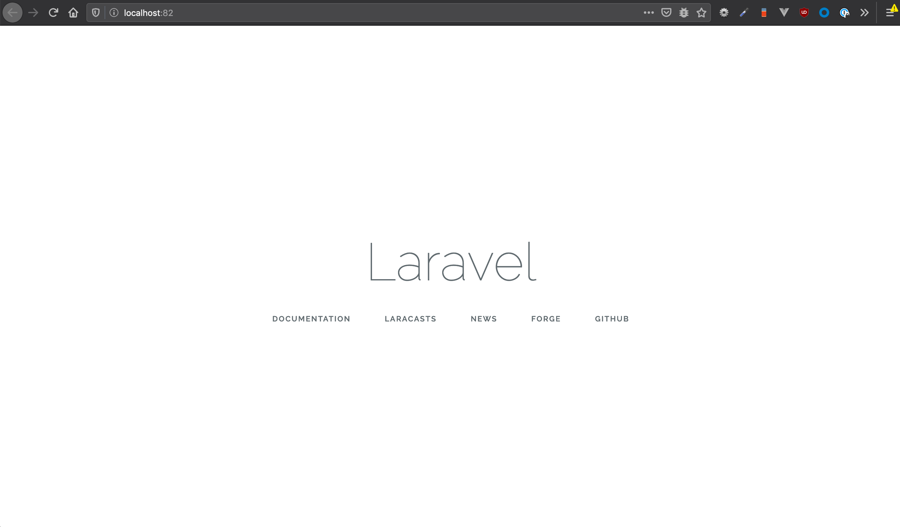

# Deploy laravel on Kubernetes with Helm chart

To more easily deploy and manage the Laravel application containers in a Kubernetes cluster, you can use Helm charts.

This guide walks you through the process of running an laravel application on a Kubernetes cluster. I will use PHP-FPM (FastCGI Process Manager), Nginx and MariaDB to run the application.

## How to get started?

Before you begin, please ensure [Docker](https://www.docker.com/), [Docker Compose](https://docs.docker.com/compose/), [Helm](https://helm.sh/) and [Kubernetes](https://github.com/dambergautam/docker-examples/blob/master/4-kubernetes/kubernetes-setup.md) are installed and Docker is running.

**Step 1:**

Clone this project `git clone https://github.com/dambergautam/laravel-kubernetes-helm.git`.

**Step 2:**

Run below command to add blank laravel project from root directory.

```
bash ./bin/install-project.sh
```

This command will
- install new laravel project `docker/laravel`
- create docker images and run containers  
- perform series of Laravel Artisan and NPM commands in the container.

To access website locally, visit http://localhost:82/.



**Step 3:**

To deploy the application on kubernetes using helm chart, create PHPFPM image
with laravel application source

Let's say `acr2.tst.apnic.net` is our docker repository -

```
# Create new image
docker build -t acr2.tst.apnic.net/webops/laravel-application:0.1.0 ./docker/Dockerfile.phpfpm

# You might have to login to push image in docker repository.
docker login acr2.tst.apnic.net

# Push image to your private repository
docker push acr2.tst.apnic.net/webops/laravel-application:0.1.0
```

Create Nginx image

```
docker build -t acr2.tst.apnic.net/webops/fellowship-nginx:0.0.3 ./docker/Dockerfile.nginx
docker push acr2.tst.apnic.net/webops/fellowship-nginx:0.0.3
```

Now, that you have all required images in docker repository, you can install/update
helm chart by running below command from root directory.

```
bash ./bin/publish_chart.sh
```
